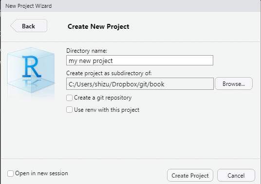
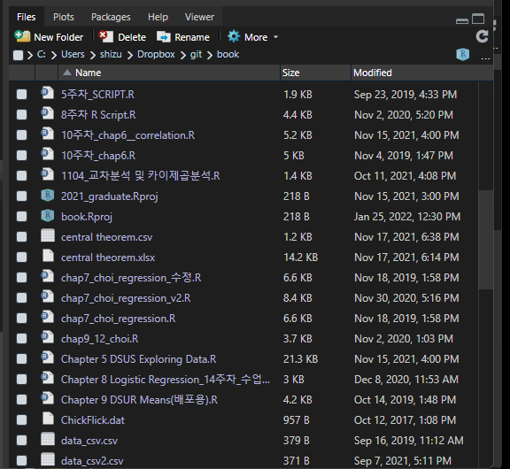

# 데이터 전처리 {#literature}


## 들어가며

R 명령어와 데이터 구조에 대한 기본적인 이해를 마쳤다면, 이제 실제 데이터를 다뤄보자. 데이터를 다룬다는 말에는 여러가지 절차가 포함되어 있다. 첫번째는 데이터를 불러와야(import)한다. 두 번째는 데이터를 예쁘게 정리해야 한다. R에 엄청난 기여를 해 온  해들리 위컴은 이러한 작업을 타이디하게(tidy, 깔끔한) 만든다고 표현한다. 데이터셋을 예쁘게 정리한다는 것은 연구의 목적에 맞게 데이터를 자르고, 붙이고, 조정한다는 뜻을 의미한다. 해들리 위컴의 정의에 따르면 타이디한 데이터는 다음과 같다. 

* 데이터의 각 열은 변수(variable)이다. 
* 데이터의 각 행은 관측값(observations)이다. 

혹자는 이러한 정의가 무슨 뜻인지 의아할 것이다. 왜냐하면 타이디하지 못한 데이터를 본적이 없기 때문이다. 일반적으로 연구 목적이 아닌 방식으로 수집된 자료(일반적인 행정데이터들이 대표적이다)가 대표적으로 언타이디 데이터이다. 연구자 인생에서 언타이디 데이터를 가급적 마주치지 않는 것이 정신건강에 이롭지만, 세상일이 그렇게 호락호락하지 않는다. 다양한 조직에서 언타이디 데이터를 그것도 어마어마한 사이즈로 보유하고 있기 때문이다. 많은 사람들이 엑셀을 사용해서 수작업(!!!)으로 데이터를 정리하다가 포기한다. 이 장에서는 언타이디 데이터를 정리하는 방법까지 포함해서 다룰 예정이다. 

세번째 단계는 데이터의 변형이다. 행과 열이 변수와 관측값으로 정리된 타이디 데이터를 나의 연구의 목적에 맞게 정리하는 것이다. 불필요한 관측값을 삭제하고(예: 취업자만 선택), 불필요한 변수값을 삭제하고(예: 1~10번째 변수만 선택하고 나머지는 drop), 결측치 를 처리하고, 새로운 변수를 생성하고(1~3의 변수의 평균값을 4번쨰 변수로 생성), 범주형 변수를 더미화하거나(), 또는 factor형 변수로 변환하여 level 정보를 추가한다. 

통상적으로 이 장에서 다루는 데이터 전처리 과정은 통계 분석 과정에서 투입되는 시간의 70% 이상을 차지한다. 특히 원자료가 untidy 할 수록 그 시간은 늘어난다. 개인적으로 학생들이 가장 어려워하고, 중간에 포기하기 쉬운 장이라고 생각한다. 그러나 데이터 전처리 스킬이 연구자의 통계분석역량의 바로미터이기 때문에 꾸준히 공부하는 것이 중요하다. 이 장을 잘 마치게 되면, 이후의 다양한 분석들이 너무 쉽게 느껴질 것이다. 

데이터 전처리는 R의 강점을 피부로 느낄 수 있는 단계중 하나이다. 통상 데이터 전처리의 전 단계는 약 50~100줄정도의 코드로 구성이 된다. 각 단계별로 작업중에 문제가 생기면 간단히 이전의 코드를 수정함으로서 재작업이 용이하다. 
만일 데이터 전처리를 GUI 방식의 통계패키지로 작업하게 되면 한순간의 실수로 그간의 작업을 통째로 날리는 경험을 할 수 있다. 이보다 더 끔찍한 일은 내가 어느 단계에서 실수했는지 확인이 안된다는 사실이다!(물론 로그를 리뷰하면 알 수 있지만, GUI를 쓰는 사람이 로그를 볼 가능성은 0프로에 가깝다). 이러한 실패(라쓰고 삽질이라 읽는다)를 몇번하고 나면, R을 배우는데 필요한 약간의 허들은 가볍게 느껴질 것이다. 

### 패키지 준비하기 

데이터 전처리는 R의 내장함수로도 어느정도 작업이 가능하지만, 이 책에서는 해들리 위컴이 개발한 tidyver 패키지를 활용하여 데이터 전처리와 시각화 작업을 수행할 예정이다. 
R은 일종의 플랫폼과 같기 때문에 다양한 분석/작업에 특화된 패키지를 설치(install)하고, 실행(library)할 수 있다. 스마트폰에 기본 카메라와 어플에서 다운받은 필터 카메라를 실행시키는 작업과 매우 유사하다. 기본 카메라로도 사진을 찍을 수 있지만, 특화된 카메라 어플은 더 나은 기능을 제공한다는 점을 유념하라. 따라서 데이터 전처리부터는 별도의 패키지를 R에 설치하고 실행하는 단계부터 시작하도록 하겠다. 

**tidyverse 패키지 설치 및 실행**

R에서 패키지를 설치하는 방법은 크게 두가지이다. 콘솔창에 install.packages("패키지 이름")를 사용하거나, R studio menu -> tools -> install pacakges에서 패키지 이름을 찾거나 입력해서 설치하는 방법이다. 통상적으로는 콘솔창에 install.packages("") 명령어를 활용한다. 
데이터 전처리에 주로 사용할 패키지는 dplyr 이다. 이 패키지를 단독으로 설치해줘도 좋지만, 앞으로 R을 사용할때 자주 활용할 패밀리 패키지를 한꺼번에 설치해보도록 하겠다. tidyvere라는 이름의 패키지는 데이터 시각화의 필수 패키지인 "ggplot2"를 비롯해서 "tibble", "tidyr", "readr", "purrr", "dplyr", "stringr", "forcats" 등이 포함되어 있다. 

* install.packages("")를 입력하고 cntrl+R을 누르면 자동으로 패키지가 실행된다. 콘솔창에 빨간버튼(stop)이 사라질때까지 기다린다. 
* 복수의 패키지를 한꺼번에 설치하고 싶으면 c 명령어를 이용한다: install.packages(c("A package", "B package"))
* 패키지를 인스톨할때 error 메시지가 뜨면 해당 메시지를 복사해서 구글링하는 것이 가장 간편한 해결방법이다. 대체로 dependency 문제일 가능성이 높다. R의 패키지들은 종종 선행해서 설치되야하는 패키지들을 갖고 있는 종속된 관계이기 때문이다. 이에 대해 더욱 잘 알고 싶다면 **를 참조하길 바란다. 이러한 문제 해결을 위해서는 처음부터 R, R studio, R tools 설치를 꼼꼼히 하는 것이 필요하다. 
* 급하게 해결하기 위해서는 다음의 옵션을 사용하자. 
install.packages("패키지 이름", dependencies=TRUE, repos="https://cran.rstudio.com")
* 패키지가 설치된 후에는 library() 명령어를 사용하여 실행시키자. 패키지 설치는 처음에만, library는 해당 스크립트 또는 프로젝트를 실행시킬때마다 수행이 필요하다. 

```{R, eval=FALSE}
install.packages("tidyverse")
library(tidyverse)
```
### 작업공간 설정하기 

패키지 설치가 완료되었다면 작업공간을 설정하는 것이 필요하다. 작업공간(workspace)란 내가 사용할 데이터, 작성한 코드, 아웃풋 파일 등을 저장할 폴더를 지정하는 것을 의미한다. R에서 작업공간을 지정하는 방식은 크게 두 가지가 있다. 


**R poject 생성 방식**

첫번째는 폴더 자체를 하나의 프로젝트(project)로 sync시키는 방법이다. 대부분의 작업을 이 방식으로 수행하는 것을 강력히 권한다. 프로젝트는 하나의 폴더와 동일해지는 개념으로 생각하면 쉽다. 

* 프로젝트 생성은 R studio -> File -> New project를 클릭
* 프로젝트는 1) 내컴퓨터 안에 새로운 폴더를 생성하는 방법, 2) 기존의 폴더를 프로젝트로 지정하는 방법 3) version control 방법으로 세가지가 존재한다. version control은 github 등과 연결하는 방법으로 부록을 참조하라
* 내컴퓨터 안에 새로운 폴더를 생성하는 방법을 기준으로 설명해보겠다. New Project -> New Directory -> New Project -> project 이름 입력 및 폴더 생성을 누르면 완성된다. 
* 프로젝트를 생성하면 projectname.Rprj이라는 파일이 해당 폴더 안에 생성된다. 이 프로젝트 안에서 생성되는 script, output 파일들이 해당 폴더 안에서 내보내기/가져오기가 자유롭게 된다. 

```{R, echo=FALSE, fig.cap='R prject 생성', fig.show='hold', out.width="40%"}
knitr:: 
knitr:: 
```

**work space 설정 방식**

두번째는 간단하게 나의 로컬 디렉토리(내컴퓨터안의 폴더)를 지정하는 방식이다. 간단한 작업을 수행할때 사용한다. 강력한 권고에도 불구하고 간단한 방식을 쓰고 싶은 사람들은 아래의 코드를 참고하라. (하지 말라는 뜻)
* getwd()를 실행하면 현재 working directory를 보여준다. 
* setwd()를 실행하면 괄호안의 경로의 폴더가 working directory로 지정된다. 내가 작성한 R script나 output이 이 폴더에 저장됨을 뜻한다. 또한 working directory안의 파일들은 별도의 경로를 지정하지 않아도 파일이름만 쓰면 알아서 R이 인지한다. 

```{R, eval=FALSE}
getwd()
setwd("C:\\Users\\Owner\\Documents\\new") 
```


### 데이터 불러오기

패키지 설치가 완료되었다면 데이터를 불러와보자. 엑셀, txt, spss 파일 등 외부데이터를 불러오기 위해서는 가져오기(import)를 실행해야 한다. 데이터를 불러온다는 뜻은 외부데이터를 불러와서 R의 dataframe으로 재저장을 한다는 것을 의미한다. 대표적인 import 명령어는 다음과 같다. 

* read.table()은 엑셀파일(.csv)을 불러올때 활용한다. 일반적인 엑셀파일 확장자명은 xlsx이지만, 이 파일형식을 불러오면 에러가 많다. 쉼표로 셀이 구분되는 .csv 파일로 재저장하여 불러오기를 하자. .xlsx를 불러오는 명령어도 따로 있지만 개인적으로 추천하지는 않는다. 
* read.spss()은 spss로 저장된 파일(.sav)을 불러올때 활용한다. 
* read.delim()은 텍스트파일(.dat)을 불러올때 활용한다. 
* 데이터를 불러올때는 반드시 옵션을 잘 지정해두어야 한다. 1번째 행(row)이 머릿행(이름, 성별 등 변수명)인 경우에는 header=T, 구분자가 쉼표일때는 sep=","의 옵션 등을 사용하도록 하자. 
* spss파일의 경우 변수별 라벨(예: 남자=1, 여자=2)를 살리는 옵션(use.value.labels=T)이 있다. 필요에 따라 활용하라

아래의 코드를 좀더 자세히 살펴보자. 첫번째 코드는 나의 프로젝트 또는 작업공간안에 있는 data_csv.csv파일을 불러와서 data_csv라는 데이터 프레임 객체를 생성하라는 뜻이다. 마찬가지로 두번째 코드는 spss 파일을 불러오는 코드이다. 
개인적으로는 거의 모든 파일을 csv 파일 형태로 전환하여 R에서 import하는 것을 추천한다. spss 등의 파일은 잡다한 정보들이 많이 붙어있어서 간혹 꼬이거나 행/열이 밀리는 경우가 존재한다. 만일 내가 spss 파일만 갖고 있다면 해당 패키지 -> 다른이름으로 저장을 누르고 저장방식을 csv로 바꾸는 것이 좋다. 


```{R, eval=FALSE}
data_csv <- read.table("data_csv.csv", header = T, sep=",") 
data_spss <- read.spss("data_sav.sav", use.value.labels=T, to.data.frame=T)
```
## dplyr 패키지의 이해

앞서서 데이터 전처리는 크게 두가지 단계 1) untidy한 데이터를 tidy 데이터로 만들기, 2) 데이터의 변형(연구목적에 맞게 데이터의 관측치 및 변수를 삭제, 조합하는 것)으로 나뉜다고 설명하였다. 이 장에서는 먼저 데이터의 변형에 대해 다루도록 하겠다. 그 이유는 untidy 데이터를 다루는 것이 더 높은 난이도이기 때문이다. 먼저 데이터 변형을 손쉽게 하는 수준에 오르게 되면, 그 다음 tidy화에 대해 배우는게 좋다. 다시말하면 이 챕터에서는 행에는 관측치가, 열에는 변수가 들어있는 데이터를 연구 목적에 맞게 변형하는것에 초점을 맞추도록 하겠다. 

데이터 전처리 과정에서 주로 사용할 패키지는 dplyr다. tidyverse패키지 안에 들어있는 패키지로 단독설치도 가능하다. dplyr의 강점은 다음과 같다. 

* R의 내장함수보다 직관적인 명령어 구조를 갖고 있다.
* R보다 복잡한 자료변형이 가능하다. 
* chain operator(%%)를 사용하여 코드를 심플하게 짤 수 있다. 


```{R, include=FALSE}
library(tidyverse)
```


### chain operator

먼저 chain operator에 대해 이해하면 dplyr의 강점을 십분 이해할 수 있다. 남이 짜둔 코드를 보다보면 마치 에러메시지와 같은 형태의 %>% 가 자주 등장한다. %>% 은 chain operator라 불리며 "and then"의 문법과 같은 의미로 사용된다. 원래 R의 기본 코드는 괄호()가 이 기능을 수행한다. 
빠른 이해를 위해 다음과 같은 짧은 코드를 살펴보자. x라는 객체를 만들고, 이 안에 30,20,10,0이라는 4개의 값을 지정한다. 만일 객체 x의 절대값(abs)을 구하고, 4개의 절대값의 평균값을 구한다음(mean), 다시 이 평균값의 제곱근(sqrt)을 구하고 싶다면 아래와 같이 코드를 짜야한다. 결국 괄호의 가장 안쪽부터 바깥쪽 까지 and then의 문법으로 계산이 이루어지는 것이다. 절대값을 구하고 and then 평균값을 구하고 and then 제곱근을 구하라는 명령이 sqrt(mean(abs()))의 코드로 구현된다. 

```{r, eval=FALSE}
x<-c(30, 20, 10, 0)
sqrt(mean(abs(x)))
```

문제는 코드가 조금만 복잡해져도 괄호 갯수 등의 실수가 자주 발생한다는 것이다. 또한 가장 나중에 수행해야할 명령이 가장 먼저 코딩되야하기 때문에 직관적으로도 이해가 쉽지 않다. chain operator는 이러한 R코드의 문법구조를 좀더 직관적으로 바꾸는 역할을 한다. 위의 코드를 chain operator를 활용해서 바꿔보면 아래와 같다

```{r, eval=FALSE}
x %>% 
  abs() %>% 
  mean() %>% 
  sqrt()
```

위의 코드에서 chain operator를 and then으로 바꾸어보면 마치 구어로 설명하듯이 편안하게 코드를 짤수 있다는 점을 확인할 수 있다. X를 가지고 와서 and then 절대값을 구하고, and then 평균값을 구하고, and then 제곱근값을 구하라는 뜻이다. chain operator는 코드가 복잡해지고, ggplot2 등을 활용하여 그래프를 그릴 때 강점이 잘 드러난다. 앞으로 이 책에서는 chain operator를 최대한 활용하여 코드를 설명할 예정이다. 다만 dplyr 패키지가 설치(install)되고 실행(library)된 상태에서만 chain operator가 정상적으로 실행된다는 점을 주의하자. 

## dplyr의 주요 기능

지금부터 dplyr의 가장 기본적이고 대표적인 기능을 하나하나 알아보도록 하겠다. 

### filter

filter 함수는 특정한 행(row)을 선택하는 기능이다. 시각적으로 생각하면 데이터를 횡의 방향으로 절단 또는 선택하는 기능이다. 예를 들어 데이터 중에 취업한 사람의 케이스만 선택하고 싶다면 filter 함수를 쓰면 된다.

코드 시현에 앞서서 R에 내장된 데이터를 불러와보자. R에는 연구자가 코드를 연습해볼 수 있는 다양한 종류의 데이터가 많이 있다. 여기서는 nycflights13이라는 데이터를 사용해보겠다. 이 데이터는 뉴욕공항에 1년동안 이륙/착륙한 비행기의 각종 정보가 담겨있다. 데이터를 불러오기 위해서는 nycflights13이라는 패키지를 설치하고 실행하면 된다. 

```{r, collapse=TRUE}
install.packages("nycflights13", repos = "http://cran.us.r-project.org")
library(nycflights13)
head(flights) # head 자료 수개를 보여줌
flight_df <-data.frame(flights)#data frame으로 변환
str(flight_df)
```

nycflights13을 실행시키면 flights라는 데이터를 사용할 수 있게 된다. 가장 먼저 데이터의 구조를 판단하고, dataframe으로 변환하는 작업이 필요하다. 

* head()는 자료의 첫 행 6개와 첫 열 6개를 보여준다. 출력결과를 살펴보면 year, month, day, dep_time 등의 변수에 정수형 자료들이 예시로 제시되어 있다. 
* data.frame()은 tibble의 자료 구조를 dataframe으로 바꾸는 명령어이다. 
* str()은 데이터 프레임의 구조(행과 열의 갯수, 변수명, 변수의 자료 유형 등)를 보여준다. 

dataframe으로 변환한 flight_df라는 객체는 R studio의 오른쪽 상단 environment창에 뜨게 된다. 이를 더블 클릭하게 되면 script 창에 우리에게 친숙한 데이터시트가 뜬다. 콘솔창에 나타난 결과를 보면 flight_df는 336776개의 관측치(=행의 갯수가 336,776개)와 19개의 변수(=열의 갯수가 19개)인 것을 확인할 수 있다. 대부분의 변수가 정수 또는 수치형 자료이고, 출발지(origin), 도착지(dest) 등은 문자형 변수이다. 

본격적으로 filter 함수에 대해 알아보자. filter는 자료를 횡으로 자르는 것이다. 바꿔말하면 어떠한 변수가 특정값인 관측치만 선택하는 것이다. 예를 들어 month가 1인 자료만 선택하고 싶다면 month=1로 필터링을 하는 것이다. 


```{r, collapse=TRUE, eval=FALSE}
##month=2인 자료만 필터링
flight_df %>% 
  filter(month==2) %>%
##month=2 or day=1 자료만 필터링
flight_df %>% 
  filter(month==2 | day==1) %>%  #shift+\
##month=2 and day=1 자료만 필터링
flight_df %>% 
  filter(month==2, day==1) %>%  #쉼표나 & 모두 사용 가능

##month=2가 아닌 자료만 필터링
flight_df %>% 
  filter(month!=2) %>%  #느낌표는 not의 의미
##month가 5이상인 자료만 필터링
flight_df %>% 
  filter(month >=5) %>%  
##month가 5, 7, 10인 자료만(복수의 조건) 필터링
flight_df %>% 
  filter(month %in% c(5,7,10))
##na 값 표시 또는 제거 해서 필터링
flight_df %>% 
  filter(is.na(month)) #na인 row만 표시
flight_df %>% 
  filter(!is.na(month)) #na가 아닌 row만 표시
```
* 주로 equal(==), and(&), or(|), not equal(!=), greater than or equal to(>=), greater than(>), less than(<), less than or equal to(<=) 를 사용하여 관측치를 필터링한다. 
* na값만 필터링하기 위해서는 is.na(), na값을 제외하여 필터링하기 위해서는 !is.na()를 사용한다. 
* 복수의 조건을 사용하여 필터링하기 위해서는 %in% c()의 구문을 사용한다. 
* dplyr의 모든 명령어는 tibble을 활용하여 임시적으로 데이터를 변형한다. 다시 말해 원래의 dataframe을 변형시키지는 않는다. 따라서 별도의 데이터 셋으로 저장하는 절차가 필요하다. 
* 만일 변형한 데이터를 저장하고 싶다면 새로운 데이터 프레임 또는 기존의 데이터 프레임에 저장하는 명령어를 추가해야한다. 저장은 아주 간단하게 <- 를 사용하면된다. summary 명령어를 통해 데이터 변형이 잘 이루어졌는지 꼭 확인이 필요하다. 

```{r, collapse=TRUE, eval=FALSE}
filter_df2 <-
  flight_df %>% 
  filter(month %in% c(5,7,10))
summary(filter_df2$month)
```

### select

select는 특정 변수(열, column)을 선택하는 명령어이다. filter와는 정반대로 dataset을 종으로 절단하는 기능이다. 1차 자료를 연구 목적에 맞게 간추릴때 필요없는 변수를 삭제하거나 필요한 변수만을 선택해야하는 경우가 있다. 이때 select가 유용하게 사용된다. 

* select() 명령어의 괄호안에 선택할 변수명을 쉼표로 이어가며 작성하는 방식이 일반적이다. 
* 콜론(:)은 연속적인 변수를 선택할때 사용한다. 
* 느낌표(!)는 해당 변수를 제외한 변수들을 선택할때 사용한다. 복수의 변수를 제외하고 싶다면 c()로 연결하면 된다. 
*startsWith, endsWith, one_of를 활용하면 변수명을 조합하여 선택도 가능하다. 

```{r, collapse=TRUE, eval=FALSE}
#month, day 변수만 선택
flight_df %>%
  select(month, day)
#year에서 day까지의 변수만 선택
flight_df %>%
  select(year:day) 
#year에서 day까지의 변수만 제외해서 선택
flight_df %>%
  select(! year:day)
#복수의 변수를 제외하고 싶은 경우 -c()를 사용
flight_df %>%
  select(-c(year, month)) 
#dep이라는 단어로 시작하는 변수들 선택
flight_df %>% 
  select(startsWith("dep"))
#time이라는 단어로 끝나는 변수들 선택
flight_df %>% 
  select(endsWith("time"))
#time 또는 delay 중 하나라도 포함되어 있는 변수들 선택
flight_df %>% 
  select(one_of(c("time", "delay")))
```

### arrange

arrange는 특정한 변수를 기준으로 정렬을 할때 사용하는 명령어이다. 오름차순과 내림차순, 그리고 두개 이상의 변수를 활용한 2차 이상의 정렬도 가능하다. 

```{r, collapse=TRUE, eval=FALSE}

##month, day 순으로 오름차순
flight_df %>%
  arrange(month, day) 
##month는 오름차순, day는 내림차순
flight_df %>%
  arrange(month, -day) 
flight_df %>%
  arrange(month, desc(day))
##month, day 순으로 내림차순
flight_df %>%
  arrange(-month, -day) 
flight_df %>%
  arrange(desc(month), desc(day))
```

### mutate

mutate는 기존의 변수를 활용하여 새로운 변수를 만드는 명령어이다. 보통 이런 변수를 파생변수(derived variables)라고 부른다. 예를 들어 소요시간(time)과 거리(distance)라는 원변수가 있다면, 거리/소요시간으로 속력(speed)이라는 새로운 변수를 만드는 방식이다. 또는 x1~x5의 5개의 문항의 평균값을 의미하는 새로운 변수를 만드는 것도 mutate 명령어를 활용할 수 있다. mutate는 크게 두가지 방식이 있다. 첫째는 덧셈, 뺄셈, 곱셈, 나눗셈, 로그, 제곱근 등 다양한 연산을 통해 파생변수를 만드는 방식, 둘째는 ifelse 구문을 활용하여 조건을 만족하는 경우 특정 값을 부여하는 방식(dummy coding) 이다. 

* mutate(새로운변수명=수식 또는 논리식)의 구조를 띈다. 
* 연산의 경우 +, -, *, /, log, sqrt 등 대부분의 연산자를 활용하여 수식을 작성한다. 
* 더미 코딩을 위해 ifelse를 사용하는 경우 mutate(새로운변수명 = ifelse(조건, TRUE값, FALSE값))의 구조를 띈다. 
* mutate의 경우 반드시 새로운 데이터 프레임으로 저장하는 명령어(->newdataframename)를 추가하는 것이 필요하다. 
* 만일 기존 변수를 삭제(drop)하고 싶은 경우에는 mutate대신에 transmute를 사용한다.
* 변수의 이름을 바꾸고 싶다면 rename(새로운변수=기존변수)를 사용한다. 

```{r, collapse=TRUE}
#평균 또는 ratio로 연산하여 새로운 변수를 생성
flight_df %>%
  mutate(mean_distance=distance/hour, 
         ratio_delay=arr_delay/(hour*60+minute)) -> flght_df_mutate
#ifelse를 활용하여 category변수 생성, ifelse(조건, 조건이 true일때, 조건이 false)
flight_df %>%
  mutate(arr_delay_group=ifelse(arr_delay>0, "delay", "no delay")) ->flight_df_mutate
#사용한 변수를 삭제하고 새로운 변수만 남기는 경우
flight_df %>% 
  transmute(total_min=hour*60+minute) -> flight_df_mutate
```

### group_by와 summarise

데이터의 전처리 단계에서는 집단별 평균값이나 빈도를 비교해야 하는 경우가 종종 발생한다. 예를 들어 성별에 따라 특정변수에 값에 차이가 있는지? 연도에 따라 평균값이 어떻게 변하는지? 학년별로 결측치 빈도가 어떻게 다른지? 등이 이에 해당된다. 
이러한 상황을 시각적으로 생각해보면 데이터가 일종의 축소 또는 요약되는 것을 쉽게 이해할 수 있다. 
예를 들어 남성 50명, 여성 50명의 IQ, GPA, 학습시간의 데이터가 있다고 생각해보자. dataframe의 형태로 생각해보면 100개의 행(row, 관측치 갯수)과 4개의 열(column, 변수의 갯수)의 100x4의 매트릭스일 것이다. 만일 성별에 따라 IQ, GPA, 학습시간의 평균값을 비교하고 싶다면 2개의 행(group의 수)과 3개의 열(변수의 수)의 2x3의 새로운 매트릭스로 결과가 제시된다. 
dplyr는 이러한 과정을 group_by(집단으로 데이터를 쪼개서 비교하고)와 summarise(데이터를 요약)의 두개의 명령어 조합으로 수행한다. 통상 group_by와 summarise는 짝꿍처럼 뗄레야 뗄수없는 사이로 표현된다. 왜냐하면 summarise 없이 group_by는 의미가 거의 없기 때문이다.

다시 flight 데이터로 돌아와보자. group_by 변수로 쓸만한 것들은 무엇이 있을까? 연속적인 수치형 변수보다는 factor 변수나 값의 갯수에 제한이 있는 수치형 자료가 group 변수로 적절하다는 것을 직감했을 거라 생각한다. 왜냐하면 출발시간(dep_time)처럼 수천개의 값을 가진 연속형 변수들을 기준으로 집단을 구분하는 것은 의미가 없기 때문이다. 
앞서 mutate에서 도착 시간 지연여부(arr_delay_group)를 만들어낸 것을 기억하자.
도착시간보다 지연 도착한 비행기는 delay, 그렇지 않은 경우는 no delay로 변형을 시켰다. 먼저 summary 명령어를 활용하여 arr_delay_group 변수의 현황을 살펴보자. 어떤 변수의 빈도를 확인하고 싶다면 r 내장함수인 table()을 써도 좋지만, dplyr에서 제공하는 count() 함수가 훨씬 간편하다. 아래 코드를 보면 (1)mutate1_flihgt_df 데이터프레임을 불러와서, (2) arr_delay_group 변수의 빈도를 count 하라는 뜻이다. 

```{r, collapse=TRUE}
mutate1_flight_df %>% 
  count(arr_delay_group)
```
결과를 살펴보면 delay인 사례는 133,004개, no delay는 194,342개, 그리고 na값이 9,430개이다. 만일 na값을 그대로 두고 group_by와 summarise 함수를 적용하면 어떻게 될까? 아래 코드는  arr_delay_group별로 arr_delay 변수의 최대값(max), 최솟값(min), 평균값(mean), 중위값(median), 4분위값(quantile)을 산출하라는 뜻이다. 

* group_by는 반드시 summarise 전에 코드가 작성되어야 한다. 
* summrise는 새로운 tibble을 만들어내는 방식이다. 다시이야기하면 observation x variables의 데이터 프레임을 활용해서 변수 x 통계값의 새로운 요약된 데이터 프레임을 만들어내는 방식이다. 따라서 각 통계값에 해당되는 일종의 변수명을 지정해주는 것이 필요하다. 
* mean(x,na.rm=TRUE) : 결측값제외하고 평균
* median(x,na.rm=TRUE) : 중앙값
* sd(x,na.rm=TRUE) : 표준편차
* min(x,na.rm=TRUE) : 최솟값
* max(x,na.rm=TRUE) : 최대값
* IQR(x,na.rm=TRUE) : 사분위수 : Q3-Q1
* sum(x,na.rm=TRUE) : 합
* n() 관측치 개수 계산, x변수 입력 하지 않음
* n_disinct(x) : 중복없는 유일한 관측치 개수 계산

```{r, collapse=TRUE}
mutate1_flight_df %>% 
  group_by(arr_delay_group) %>% 
  summarise(max=max(arr_delay),
            min=min(arr_delay), 
            mean=mean(arr_delay), 
            med=median(arr_delay), 
            per25=quantile(arr_delay, 0,25))
```

결과값을 살펴보면 no delay 집단의 경우 arr_delay 값이 음수값을 가지기 때문에 통계값 역시 음수값을 갖는 것으로 확인되었다. 문제는 na 집단이다. na 집단을 제외하고 다시 summarise를 해보도록 하자. 앞에서 쓴 코드에 filter 명령어만 삽입하면 간단하게 해결된다. !is.na()가 na가 아닌 row만 표시하는 옵션임을 기억하자. 마지막으로 summarise 함수의 작동방식을 제대로 이해하기 위해 아웃풋을 final이라는 dataframe으로 별도로 저장해보자. 

```{r, collapse=TRUE}
flight_df %>%
  filter(!is.na(arr_delay)) %>%  #na가 아닌 row만 표시
  mutate(arr_delay_group=ifelse(arr_delay>0, "delay", "no delay")) %>% 
  group_by(arr_delay_group) %>% 
  summarise(max=max(arr_delay),
            min=min(arr_delay), 
            mean=mean(arr_delay), 
            med=median(arr_delay), 
            per20=quantile(arr_delay, 0,25),
            n=n())->final
final
```
## 데이터 결합하기 

연구를 진행하다보면 두개 이상의 데이터를 결합해야 하는 경우가 종종 발생한다. 시계열 데이터를 연결하는 것이 가장 대표적인 사례다. 또는 몇개의 변수를 더 추가하거나, 몇 개의 사례를 더 추가하는 등의 간단한 결합도 자주 발생한다. dplyr는 다양한 종류의 데이터 결합에 탁월한 기능을 갖고 있다. 혹자는 엑셀로 데이터를 붙이는 무모한 시도를 하는 경우가 있는데 대체로 많은 오류를 발생시킨다. 특히 데이터에 빈 구멍이 있는 경우에는 더욱 그러하다. 예를 들어 어떤 패널 데이터의 1차년도 자료와 2차년도 자료를 결합하는 상황을 생각해보자. 종단데이터의 경우 각 관측치(사례)를 연결하는 key 변수인 ID를 제공한다. 하지만 1차년도 자료와 2차년도 자료는 완전히 동일한 ID가 아닌 경우가 많다. 1차년도에는 응답하였지만 2차년도에는 응답하지 않은 사람은 어떻게 처리해야할까? 또 1차년도 자료와 2차년도 자료와 동일한 변수는 어떻게 drop 해야 할까? dplyr는 이러한 다양한 데이터 결합에 최적의 기능을 제공한다. 이 챕터에서는 아주 간단한 결합(단순히 coloums과 rows를 추가하는 형태)부터 복잡한 결합(두 자료의 교집합 또는 한자료의 여집합만 결합하는 형태 등)을 구분하여 설명해보도록 하겠다. 

### bind_cols와 bind_rows로 데이터 결합하기

bind 명령어는 말그대로 두개의 벡터를 결합하는 기능이다. 좀더 손쉬운 이해를 위해 간단한 데이터 셋 두개를 직접 만들어서 붙여보자. 2장을 복습할 겸 BTS 데이터를 다시 만들어보자. BTS 멤버 7명의(row 7개) 이름, 출생년도, 포지션의 3개의 변수(column 3개)로 구성되어 있는 bts1이라는 데이터 프레임을 생성해보았다. 다음으로는 각 멤버별 솔로곡의 이름을 문자형 변수로 지정한 bts2라는 데이터 프레임을 추가로 생성하였다. 두 데이터 프레임을 결합한다는 것은 변수를 한개 추가하는 것이기 때문에 bind_cols의 명령어를 사용한다. 결합해야하는 2개 이상의 데이터 프레임 이름을 쉼표를 활용하여 연결시켜준다.

```{r, collapse=TRUE}
#bts1 dataframe 만들기
btsname <-c("RM", "Jin", "Suga","Jhope", "Jimin", "V", "JK")
btsyear <-c(1994, 1992, 1993, 1994, 1995, 1995, 1997)
btsposition <-c("rap", "vocal", "rap", "rap", "vocal", "vocal","vocal")
bts1 <-data.frame(btsname, btsyear, btsposition, stringsAsFactors = FALSE)
#bts2 dataframe 만들기
soloSong <-c("her", "epiphany", "seesaw", "justDance", "serendipity", "singularity", "euphoria")
bts2<-data.frame(soloSong)
#bts1과 bts2를 횡으로 결합하기 (변수추가)
bind_cols(bts1, bts2)
```
결과를 살펴보면 bts1 데이터 프레임에 soloSong이라는 변수가 잘 결합되어 있는것을 볼 수 있다. 만일 새로 추가하는 변수에 missing 값이 있다면 어떻게 될까? NA가 포함되어 있는 bts3, bts4의 데이터 프레임을 추가로 생성하여 bind_cols를 사용하여 결합해보았다. 결과에서 볼 수 있듯이 NA가 포함되어 잘 연결되어 있는 것을 볼 수 있다.

```{r, collapse=TRUE}
singularity <-c(NA, "vocal", NA, NA, "vocal", "vocal", "vocal")
tear <-c("rap", NA, "rap", "rap", NA, NA, NA)
bts3<-data.frame(singularity)
bts4<-data.frame(tear)
bind_cols(bts1, bts2, bts3, bts4)->bts
```

bind_cols를 사용할때 유의할 점과 강점은 다음과 같다. 

* bind_cols(dataframe1, dataframe 2,....)의 명령어 구조를 사용한다. 
* NA가 포함되어 있는 셀들은 이상없이 결합된다. 
* 데이터 프레임의 행(rows)의 갯수가 서로 다르면 작동이 되지 않는다. 예를들어 bts1의 행의 갯수가 7개, bts2의 행의 갯수가 6개이면 결합되지 않는다. 

두번째로 rows를 추가하는 방식은 bind_rows를 사용한다. 이를 위해 제8의 멤버로 army를 추가해보도록 하겠다. 이름에만 army를 추가하고 나머지 변수에는 NA값을 할당하였다. bind_rows 역시 bind_cols와 유사하게 괄호안에 데이터프레임명을 쉼표로 연결하면 된다. 

```{r, collapse=TRUE}
army <-data.frame(btsname="army", btsyear=NA, btsposition=NA, soloSong=NA, singularity=NA, tear=NA)
bind_rows(bts, army)
```

bind_rows는 comlumn이 서로 동일하지 않아도 결합된다. 즉, 두개의 데이터 프레임이 서로 동일한 변수가 아니어도 결합이 된다는 의미이다. 예를 들어 ARMY의 국적이라는 변수를 하나 추가해보자. army2에는 bts 데이터 프레임에 없는 변수(nations)가 존재하지만 두 데이터 프레임이 종의 방향으로 잘 결합된 것을 확인할 수 있다. 

```{r, collapse=TRUE}
army2 <-data.frame(btsname="army", btsyear=NA, btsposition=NA, soloSong=NA, singularity=NA, tear=NA, nations="worldwide")
bind_rows(bts, army2)
```
또한 id 변수를 추가하여 데이터프레임의 소스를 알 수 있는 방법도 있다. 여러개의 데이터 프레임을 붙이다보면 어떤 케이스가 어떤 데이터 프레임에서 왔는지를 알아야 하는 경우가 있다. column을 추가하는 경우에는 변수명에 기입이 가능하지면 row를 추가하는 경우에는 새로운 flag 변수를 만들어주는 방법이 필요하다. 

```{r,collapse=TRUE}
bind_rows(list(data1=bts, data2=army), .id="flag")
```

### join으로 데이터 결합하기

join 명령어를 사용하면 bind_cols와 bind_rows보다 복잡한 데이터 결합이 가능하다. join 명령어를 사용하기 위해서는 key 변수를 이해해야한다. join 명령어는 열(column)간의 결합이다. 예를들어 첫번째 데이터에는 A,B,C라는 3개의 케이스에 name, X1, X2라는 세개의 변수가 붙어있다고 생각해보자. 두번째 데이터에는 A, B, D라는 3개의 케이스에 name, X2, X3라는 세 개의 변수가 붙어있다. 두 데이터를 결합한다는 것은 열(column)간의 결합이다. 이때 결합의 기준은 name이라는 변수일 것이다. 즉, 연구자는 A라는 사람의 관련변수가 횡의 방향으로 잘 붙길 바랄것이다. key 변수의 특징과 조건은 다음과 같다. 

* join 명령어는 key변수를 기준으로 두 데이터를 결합하는 것이다. 
* key 변수는 두 데이터에 공통적으로 들어가있어야 한다. 
* key 변수는 두개 의 데이터의 각 관측치마다 고유한 값이 부여되야 한다. 즉, ID, 이름과 같이 각 관측치마다 서로 다른 값을 가져야 한다. 성별, 학년과 같이 관측치마다 동일한 값을 가진다면 key 변수로 활용할 수 없다. 

key 변수를 결정하게 되면 두개의 데이터를 어떠한 방식으로 결합할지 결정해야 한다. join의 결합방식은 크게 4가지가 있다. 

#### left_join : 첫번째 데이터를 기준으로 결합

join에서 가장 기본적인 방식은 left_join이다. left_join은 첫번째 데이터(왼쪽 데이터)의 모든 관측값을 보존하고, 두번째 데이터는 첫번째 데이터와 결합될 수 있는 데이터만 살리는 방식이다. 

좀더 명확한 이해를 위해 가상의 데이터 두개를 만들어 보자. 

```{r, collapse=TRUE}
#data1 만들기 
id <- c(1, 2, 3)
name <- c("RM", "jin", "suga")
solo <- c("her", "ephipany", "seesaw")
data1 <- data.frame(id, name, solo)
data1

#data2 만들기
id <- c(1,2,3,4,5,6,7)
name <- c("RM", "jin", "suga", "jhope", "jimin", "v", "jk")
solo <- c("her", "epiphany", "seesaw", "justDance", "serendipity", "singularity", "euphoria")
position <-c("rap", "vocal", "rap", "rap", "vocal", "vocal","vocal")
data2 <-data.frame(id, name, solo, position)
data2

#left_join
data1 %>% 
  left_join(data2, by= "id")
data1 %>% 
  left_join(data2, by="id", suffix=c("_data1", "data2"))
```

inner_join 결과를 살펴보면 key 변수(id)를 기준으로, data1의 행(rows)만 남고 나머지 행들은 누락된 것을 볼 수 있다. 다시 말해 data1의 RM, jin, suga의 세 사람에 해당되는 값만 살아있다. 특이한 것은 name, solo라는 두개의 변수가 data1과 data2에 중복되어 있기 때문에 이 변수들이 두번씩 포함되어 있다는 점이다. 데이터 소스를 확인하기 위해 dplyr에서는 자동으로 .x와 .y로 변수명을 변경하여 결합해준다. 만일 연구자가 원하는대로 중복 변수의 이름을 바꿔주고 싶다면 suffix=c("", "") 옵션을 사용한다. 

* by="key변수 이름"을 반드시 지정해준다
* 만일 key 변수의 이름이 data1과 data2에서 다르다면 by=c("왼쪽데이터의 key변수 이름"="오른쪽데이터의 key변수 이름")의 옵션을 사용한다. 
* 중복변수의 이름을 _data1과 _data2로 바꾸고 싶다면 suffix=c("_data1", "_data2")의 옵션을 추가한다. 
* 중복변수를 삭제하고 싶다면 select 함수를 사용하면 된다. 

#### right_join :두번째 데이터를 기준으로 결합

left_join을 이해했다면 나머지 join 방식도 쉽게 이해할 수 있다. right_join은 left_join과 정 반대로 오른쪽 데이터의 행(rows)를 기준으로 데이터를 합친다. 
```{r, collapse=TRUE}
data1 %>% 
  right_join(data2, by="id")
```

right_join 결과를 살펴보면 data2의 행을 모두 살아있다. data1은 세명의 데이터만 있기 때문에 매칭되지 않는 열은 모두 na로 표시되어 있는 걸 확인할 수 있다. 

#### inner_join :첫번째 데이터와 두번째 데이터의 교집합 행만 결합

inner_join은 첫번째 데이터와 두 번째 데이터의 중복된 열만 호출한다. inner_join을 보여주기 위해 data1에 하나의 열을 추가해보도록 하겠다. 

```{r, collapse=TRUE}
army <-data.frame(id=8, name="army", solo=NA)
bind_rows(data1, army)
data1
data1 %>% 
  inner_join(data2, by="id")
```

data1에는 id 1,2,3,8이 포함되어 있고, data3에는 id 1,2,3,4,5,6,7이 포함되어 있다. 따라서 inner_join의 결과는 두 데이터의 교집합인 1,2,3만 포함되는 것을 확인할 수 있다. 

#### full_join : 두 데이터의 모든 행을 결합

full_join은 두 데이터의 모든 행을 결합하는 형태이다. 데이터의 손실을 가장 최소화하나, 새롭게 추가되는 변수들에 값을 가지지 않기 때문에 na도 가장 많이 발생한다. 어떤 연구자들은 full_join으로 데이터를 결합한후에 필요없는 변수나 케이스들을 filter와 select를 통해 drop하는 방식을 쓰기도 한다. 

```{r, collapse=TRUE}
data1 %>% 
  full_join(data2, by="id")
```
full_join 결과를 살펴보면 data1의 id 1,2,3,8과 data2의 id 1,2,3,4,5,6,7이 결합되어 전체 1~8의 id에 해당되는 행이 모두 호출된 것을 확인할 수 있다. 


## 데이터를 타이디하게 만들기 : pivot_longer와 pivot_wider

지금까지 살펴본 데이터들은 이미 정련이 되어 있는 tidy data이다. tidy data란 무엇인가? tidyverse를 만든 해들리 위컴^[Hadley W. & Garett, G. (2017). R for data science]의 정의에 따르면 tidy data는 다음과 같은 세개의 조건을 만족해야 한다. 

* 변수마다 해당되는 열이 있어야 한다. 
* 관측치마다 해당되는 행이 있어야 한다. 
* 값마다 해당하는 하나의 셀이 있어야 한다. 

얼핏보면 간단한 규칙같지만, 이 세개의 조건은 서로 연관되어 있다. 이 셋 중 두 가지만 충족시키는 것은 불가능하기 때문이다. 좀 더 이해하기 쉬운 조건으로 요약해보면 다음과 같다. 

* 변수는 열에 위치해야한다(행x)
* 관측치는 행에 위치해야 한다. (열x)
* 하나의 셀에는 하나의 값만이 존재해야 한다(두개 이상의 정보가 결합되면 안된다)

개인적으로는 해들리위컴이 이야기하는 untidy data의 설명을 매우 좋아한다. 

> 깔끔한 데이터셋은 모두 비슷하지만 엉망인 데이터셋은 자기 멋대로 엉망이다

이처럼 untidy data는 무궁무진한 방법으로 연구자를 괴롭힌다. 이를 해결하기 위해서는 tidyverse에 포함되어 있는 tidyr 패키지를 활용한다. tidyr에서 가장 중요한 함수는 pivot_longer와 pivot_wider이다. 함수명에서 확인할 수 있듯이 long data를 wide로, 또는 wide data를 long으로 바꾸는 함수이다. 
엑셀을 사용해본 사람이라면 피봇(pivot)이라는 용어를 자주 들어봤을 것이다. 본래 피봇이란 "축을 중심으로 회전시키다"는 뜻을 갖고 있다. 데이터 피봇이란 어떠한 축을 중심으로 long format과 wide format으로 변환시킨다는 뜻이다.  

* long format은 말그대로 세로 방향으로 길게 늘어진 형태의 데이터를 의미한다. 가장 대표적인 long format은 시계열 데이터이다. 10명의 사람의 3개년도 키를 long format으로 작성한다면 30개의 행(10명*3)과 3개의 변수(이름, 연도, 키)로 30 x 3의 데이터프레임으로 만들 수 있다. 

* wide format은 연도 등과 같은 변수를 행이 아닌 열로 표기하는 방식이다. 10명의 사람의 3개년도 키를 wide format으로 작성한다면 10개의 행(10명)과 4개의 변수(이름, 1차년도키, 2차년도키, 3차년도 키)로 10 x 4의 데이터 프레임으로 만들 수 있다. 

long format과 wide format중 어떤 것이 더 좋을까? 이는 분석방식에 따라 다르다. 통상적으로 데이터 분석에는 long format을, 직관적으로 이해하기 쉬운 형태는 wide format을 사용하곤 한다. 

보다 구체적인 이해를 위해 실제 데이터 셋을 하나 만들어보자. bts의 2016년부터 2019년까지의 앨범 판매량을 연도별로 기입한 자료를 두개의 데이터 셋으로 구성하였다. btsAlbumSales_wide는 wide format으로 작성되어 있다. 총 6개의 앨범의 4년간의 앨범 판매량이 횡의 방향으로 구성되어 있다. 흔히 볼수 있는 표의 모습이다. btsAlbumSales_long은 데이터 분석에 더 적합한 형태이다. 연도가 하나의 변수로 병합되고, 각 앨범의 연도별 판매량이 하나의 변수로 병합되어 있다. 


```{r, echo=FALSE, collapse=TRUE}
album <- c("youngForever", "youngForever", "youngForever", "youngForever", "wings", "wings", "wings", "wings", "youNeverWalkAlone", "youNeverWalkAlone", "youNeverWalkAlone", "loveYourself_Her", "loveYourself_Her", "loveYourself_Her", "loveYourself_Tear", "loveYourself_Tear", "loveYourself_Answer", "loveYourself_Answer")
year <-c(2016,2017,2018,2019,2016,2017,2018,2019,2017,2018,2019,2017,2018,2019,2018, 2019, 2018, 2019)
sales <-c(368369, 89761, 129838, 66344, 751301, 93132, 129790, 66770, 768402, 111838, 63580, 1493443, 333445, 133534, 1849537, 122742, 2197808, 154676)
btsAlbumSales_long<-data.frame(album, year, sales)


album2 <- c("youngForever", "wings", "youNeverWalkAlone", "loveYourself_Her", "loveYourself_Tear", "loveYourself_Answer")
year2016 <-c(368369, 751301, NA, NA, NA, NA)
year2017 <-c(89761, 93132, 768492, 1493443, NA, NA)
year2018 <-c(129838, 129790, 111838, 333445, 1849537, 2197808)
year2019 <-c(66344, 66770, 63580, 133534, 122742, 154676)
btsAlbumSales_wide <-data.frame(album2, year2016, year2017, year2018, year2019)
```


```{r, collapse=TRUE}
btsAlbumSales_wide
btsAlbumSales_long
```

### 길게 만들기 : pivot_longer 활용하기 

long format과 wide format의 차이를 이해했다면, pivot_longer 함수를 활용해 데이터를 길게 만들어보자. btsAlbumSales_wide를 longe format으로 만들기 위해서는 다음의 파라미터를 이해해야 한다. 

* col : 현재는 변수로 지정되어 있지만 값(value)으로 변환할 column 이름 (지정방식은 select() 함수와 동일). 이 데이터에서는 year2016~year2019이다. 
* names_to : 값으로 변환될 자료들의 변수 이름. 이 데이터에서는 year이다. 
* values_to : wide하게 분산되어 있는 값들의 변수 이름.이 데이터에서는 sales이다. 

```{r, collapse=TRUE}
btsAlbumSales_wide %>% 
  tidyr::pivot_longer(col=year2016:year2019, names_to="year", values_to="sales") ->long
long
```
long format으로 바꾼 결과를 살펴보면 year변수에 연도가, sales 변수에 각연도별 앨범판매량이 잘 결합된것을 확인할 수 있다. 하지만 year변수의 값이 wide foramt의 변수명으로 들어가 있기 때문에 year2016로 표기되어 있어 수정이 필요하다. 여러가지 방식으로 수정이 가능하지만 여기서는 str_replace()함수를 한번 활용해보도록 하겠다. str_replace는 stringr 패키지 안에 있는 함수이다. 패키지명에서 짐작할 수 있듯이 stringr은 문자열 변수를 수정하는데 활용되는 패키지이다. str_replace는 종종 사용되는 함수인데 특정 문자열을 없애거나 다른 문자로 대체하는데 쓰인다. 특정 변수의 값들의 문자열을 다른 문자로 대체하거나 없애고 싶으면 mutate()와 str_replace()를 결합하면된다. 복잡해보이지만 찬찬히 분해해보면 그리 어렵지 않다. 

* mutate(새로운변수=바뀌는 내용) : 여기서는 year 변수를 str_replace 함수를 활용해서 바꾸라고 제시되어 있다.
* str_replace(변수명, "바뀌기전 문자", "바뀐후 문자") : 여기서는 year 문자를 없애는 것이다. 큰따옴표 안에 아무것도 없는 것을 확인하라

```{r, collapse=TRUE}
btsAlbumSales_wide %>% 
  pivot_longer(col=year2016:year2019, names_to="year", values_to="sales") %>% 
  mutate(year=str_replace(year, "year", ""))->long_replace
long_replace
```
### 넓게 만들기 : pivot_wider 활용하기

pivot_wider는 pivot_longer의 반대이다. 관측값이 여러 행에 걸쳐있을때 이를 열로 변환하는 방식이다. pivot_wider는 두개의 파라미터만 필요하다. 

* names_from: 변수 이름을 포함하는 열, 여기서는 year 이다. 
* values_from: 새로 생겨나는 변수별 값이 포함되는 열, 여기서는 sales이다. 

```{r, collapse=TRUE}
btsAlbumSales_long %>% 
  pivot_wider(names_from=year, values_from = sales)->wide
```

## 패널데이터를 활용한 데이터 전처리 실습

지금까지는 dplyr 함수의 이해를 돕기 위해 small dataset을 활용해보았다. 실제 연구 장면에서는 이보다 사이즈가 큰, 즉 1000개이상의 관측치와 100개이상의 variable을 갖고 있는 데이터셋을 만지게 될것이다. 여기서는 한국직업능력연구원에서 수행하고있는 패널데이터인 인적자본기업패널(Human Capital Corporate Panel)을 활용해 데이터의 결합과 전처리 과정을 수행해보도록 하겠다. 처음 데이터를 만지다보면 데이터 다운로드후 불러오기 부터 난항을 겪는 경우가 많다. 최대한 스텝바이스텝으로 독자들의 눈높이에 맞춰 전처리 과정을 수행해보도록 하겠다. 이장은 반드시 함께 실습을 해보는 것을 권한다. 

### 데이터의 이해

데이터 전처리 전에 수행해야 할 첫번째 단계는 데이터의 이해이다. 보통 발행기관의 홈페이지에서 상세한 내용을 제공한다. 한국직업능력연구원의 인적자본기업패널(HCCP) 소개 페이지를 보면 다음의 내용이 적혀있다. 

> 1. HCCP Ⅰ차 WAVE는 2005년부터 1차년도 조사를 시작하여 격년마다 추적 조사를 실시하였으며 2017년 7차년도를 끝으로 조사를 종료하였습니다.

1번의 내용을 읽으면 여러분은 다음의 생각을 할것이다. "격년으로 조사한 7개의 데이터 셋 존재하겠군", "7개의 데이터 셋에는 기업별 ID 변수가 있어서, 동일한 기업의 연도별 데이터를 횡으로 결합할 수 있다", "7번 조사에 모두 참여한 기업도 있지만, 중간중간 빠진 기업도 있겠군", "14년의 기간동안 없어진 기업도 있을텐데 표본 대체가 이루어졌을 까?"

> 2. HCCP는기업단위 패널조사입니다. HCCP 조사의 가장 큰 특징은 조사 기본 단위가 ‘기업’이라는 점과 해당 기업 및 근로자를 함께 조사한다는 것입니다.

2번의 내용을 읽으면 이 데이터의 단위가 "기업"이라는 점을 확인할 수 있다. 꼬리를 무는 생각은 다음과 같을 것이다. "기본적으로 기업단위로 데이터가 있겠군", "기업과 근로자를 함께 조사하였다고 하니, 기업데이터와 근로자 데이터가 분리되어 있겠군", "근로자데이터와 기업데이터를 붙이기 위해 기업과 해당 기업재직자데이터는 기업 ID 등으로 결합할 수 있겠군". 또 다음의 질문도 생길것이다. "1개의 기업당 몇명의 근로자를 조사했을 까?"

추가적인 질문에 대한 답을 찾기 위해서는 해당데이터의 "조사설계" 자료를 살펴보도록 하자. 

> 3. HCCP의 모집단은 우리나라에서 사업 활동을 하고 있는 모든 기업체를 대상으로 합니다. HCCP의 조사 모집단은 NICE평가정보(주)의『KIS 기업 Data(2005)』 개요 정보에 속한 기업 중 근로자 수 100인 이상이면서 일반 기업 이상입니다. 이에 따라 조사모집단 수는 1,899개개이며, 조사에서 제외된 산업은 인적자본의 축적이 크게 의미가 없는 산업(1차산업과 제조업 일부 산업 등)입니다. 

3번의 내용은 조사설계를 소개하는 웹페이지의 일부이다. HCCP조사 목적에 따라 100인 미만의 소기업들은 제외되고, 인적자본 축적과 관련이 없는 산업들이 빠져 1,899개의 기업이 모집단인 것을 확인 할 수 있다. 

> 4. 기업의 표본추출을 위해 층화표본추출을 하였으며,  층화변수는 산업(대분류 3개 산업, 중분류 16개 산업), 규모(100~299명, 300~999명, 1,000~1,999명, 2,000명 이상), 기업형태(상장, 코스닥, 등록/외감/일반)를 사용하였다. 표본은 450개 기업이며, 흡수합병, 폐업 등으로 조사가 불가능한 경우에는 동입 업종, 동일 규모의 기업으로 표본을 대체하였다.

4번의 내용은 표본이 500개 기업이며, 산업, 규모, 기업형태를 고려해서 층화표집했다는 내용이다. 우리가 예상한것처럼 조사가 불가능한 경우 표본 대체가 이루어진 것을 확인할 수 있다. 

> 5. HCCP의 근로자 조사는 표본추출된 기업의 팀 단위로 팀장 및 팀원을 산업별/기업규모별 선정 기준에 따라 대상자를 선정하여 조사하였습니다. 근로자 조사는 팀 단위로 팀장 및 팀원을 조사하였습니다. 
 * 제조업은 관리직(팀장, 팀원)과 생산직(감독자, 근로자) 조사
* 금융업은 관리직(팀장, 팀원)과 서비스직(팀장, 팀원) 조사
* 비금융서비스업은 관리직(팀장, 팀원)과 핵심 전문직(팀장, 팀원) 조사

5번은 기업조사와 별도로 해당 기업에 재직중인 근로자를 조사하는 방법을 설명하고 있다. 근로자 조사는 팀단위로 조사하였으며 팀장과 팀원 또는 감독자와 근로자와 같이 근로자 조사 안에서도 일종의 hierarchy가 있는 것을 확인할 수 있다. 

> 6. 관리직 팀장은 기업 규모를 고려하여 조사 기업 당 5～10명 조사, 관리직 팀원은 기업 규모를 고려하여 조사 기업 당 12～16명 조사, 생산직/서비스직/핵심전문직 팀장(감독자)은 기업 규모를 고려하여 조사 기업 당 2～5명 조사, 생산직/서비스직/핵심전문직 팀원(근로자)은 기업 규모를 고려하여 조사 기업 당 10～25명 조사

6번의 내용은 팀장(또는 감독자)와 팀원(또는 근로자)의 조사규모를 보여주고 있다. 기업규모와 산업유형에 따라 근로자 조사 규모가 서로 다른것을 알 수 있다. 

이와 같이 조사에 대한 간략한 개요를 살펴보는 것은 데이터 구조를 파악하는데 큰 도움을 준다. 다짜고짜 데이터를 다운받거나 설문지부터 확인하는 것은 좋은 방법이 아니다. 조사 개요를 숙지한 이후에는 조사기관에서 제공하는 user guide를 살펴보는 것이 필요하다. 유저 가이드는 조사 개요보다 더 상세한 정보를 제공하고 있는데, 특히 샘플 사이즈, 표본탈락률 등과 같은 기본 정보와 함께 설문지의 구조 및 흐름을 확인하는데도 매우 큰 도움이 된다. 

### 데이터의 불러오기(import)

대략적으로 HCCP 데이터에 대해 이해를 하였으니, 이제 본격적으로 데이터를 다운받아 열어보자. 이 장에서는 
3차년도와 4차년도 자료를 횡으로 결합해보도록 하겠다. 현재 작업중인 r project 폴더에 3차년도와 4차년도의 기업자료와 근로자데이터 총 4개를 담아보도록 하겠다. 통상 조사기관에서는 spss, sas, txt의 세 종류의 포맷으로 제공해주는데, txt 파일을 사용해도록 하겠다. 아래의 파일을 다운받아 r project 폴더에 넣어보자.

 * HCCP_Head_3th.txt
 * HCCP_Head_4th.txt
 * HCCP_Work_3th.txt
 * HCCP_Work_4th.txt

txt 파일을 불러오는 방법은 read.delim()이다. 현재 프로젝트 안에 파일이 있다면 번거롭게 directory를 설정하지 않아도, 파일명만을 기입하면 된다. 

```{r,collapse=TRUE}
company_3 <-read.delim("HCCP_Head_3th.txt", header = T)
company_4 <-read.delim("HCCP_Head_4th.txt", header = T)

worker_3 <-read.delim("HCCP_Work_3rd.txt", header = T)
worker_4 <-read.delim("HCCP_Work_4th.txt", header = T)
```

결과창을 살펴보면 4개의 파일중에 HCCP_Head_4th.txt에 문제가 생긴것 같다. 당황하지 말고 콘솔창에 나타난 error 메시지를 구글링해보도록 하자. 약 99%의 문제는 stack overflow 같은 통계사용자들의 모임등에서 해결책을 찾을 수 있다. 이 에러메시지는 아무래도 인코딩(encoding)의 문제인것 같다. 인코딩은 한글이나 알파벳등과 같은 문자를 컴퓨어가 이해할 수 있는 언어(1 또는 0)로 변환하는 일종의 규칙이다. 한글이 들어있는 경우 특히 이런 문제가 자주 발생한다. 문제가 되는 파일을 메모장에서 열어보면 오른쪽 하단에 인코딩방식이 적혀있다. 여러분도 컴퓨터에서 확인해보면 이 파일만 utf-16의 방식으로 인코딩되어 있는 것을 알 수 있다. read.delim()의 옵션에 fileEncoding=""으로 쉽게 해결할 수 있다. 

```{r,collapse=TRUE}
company_4 <-read.delim("HCCP_Head_4th.txt", header = T, fileEncoding="utf16")
```
성공적으로 파일불러오기(import)를 하였다면, 다음단계는 파일을 탐색하는 것이다. Environment 창에 company_3, 4, worker_3,4가 로딩된 것이 보이는가? 이는 txt파일을 r의 dataframe으로 성공적으로 불러왔음을 의미한다. 우선 근로자 데이터를 살펴보자. 유저가이드 상에는 ID 구조를 다음과 같이 안내하고 있다. 

* id1 : 기업 ID, 4자리, 데이터 연결작업시 key 변수로 활용
* id2 : 사업장 ID, 1자리 (변수값 1=첫번째 작업장)
* id3 : 팀 ID, 3자리 (연구개발=100, 영업=200, 관리=300, 생산관리/기술=400, 상품개발=500, 자금운용=600, 생산직=700, 서비스직=800, 핵심전문직=900)
* id4: 개인 ID, 2자리(팀장=0, 팀원은 1부터 일련번호)

```{r, collapse=TRUE}
worker_3 %>% 
  count(W3_id1)
worker_3 %>% 
  count(W3_id2)
worker_3 %>% 
  count(W3_id3)
```
출력결과를 살펴보면 W3_id2의 경우 해당 변인을 찾을 수 없다는 에러메시지가 뜬다. Environment 창에서 다시 변수명칭들을 살펴보니 일부 변수가 소문자 w로 기입되어 있다. 이런 사소한 문제가 연구자들을 괴롭히는 경우가 많다. 사소한 문제 해결 과정까지 책이서 보여주기 위해 가공되지 않는 원자료를 활용하고 있다. 다시 문제로 돌아와서 위의 문제를 어떻게 해결하면 좋을까? 물론 변수명을 일일이 확인하면서 수정할 수도 있지만 너무 귀찮은 일이다. 우리가 활용할 4개의 데이터 프레임을 살펴보니 변수명이 제각각이다. 어떤 데이터는 첫문자만 대문자, 어떤 데이터는 변수전체가 대문자, 어떤 데이터는 변수전체가 소문자이다. tidy하게 만들기 위해서 전체 변수를 소문자로 바꿔보자^[변수명 변환은 dplyr의 rename 관련 문서를 참조하길 바란다. 일괄변환의 경우 rename_all, rename_with 등의 명령어가 도움이 된다]. https://dplyr.tidyverse.org/reference/select_all.html]. dplyr의 rename명령어는 변수명을 변경하는데 사용한다. 우리의 작업은 매우 간단하기 때문에(일괄 소문자 변경), rename_all(tolower) 명령어로 모든 변수를 소문자로 변경해보자.

```{r, collapse=TRUE}
worker_3 %>% 
  rename_all(tolower)->worker_3
worker_4 %>% 
  rename_all(tolower)->worker_4
company_3 %>% 
  rename_all(tolower)->company_3
company_4 %>% 
  rename_all(tolower)->company_4
```
ID관련 변수 4개의 빈도를 확인해보니, 이제 정상적으로 출력이 된다. id1은 기업ID로 473개의 기업별로 근로자 데이터가 2~수십개 존재한다. id2는 사업장(영업소 등)으로 0,1,2,3의 값이 존재한다. id3은 팀 ID 이다. 세자리 수 첫번째 자리의 수가 팀의 직무를 나타낸다. 예를 들어 101, 102, 103의 사례수가 각각 1103, 45, 14로 1162개이므로 연구개발 팀(id3=100번대)에 속한 근로자수가 1162명인것을 알 수 있다. 

```{r, collapse=TRUE}
worker_3 %>% 
  count(w3_id1)
worker_3 %>% 
  count(w3_id2)
worker_3 %>% 
  count(w3_id3)
worker_3 %>% 
  count(w3_id4)
```


### 필요한 변수만 선택(select)

좀더 간명하게 데이터를 확인하기 위해 필요한 변수만 선택해서 남겨보도록 하겠다. 편의상 이 장에서는 아래의 변수만을 선택해보자. 3차년도 근로자 기준으로는 아래와 같은 36개의 변수만을 select 해보자. 4차년도도 변수명 w3를 w4로 바꾼후 select 해보자. 

* ID변수 : w3_id1(기업id), w3_id3(팀id),w3_id4(팀원id)
* background 변수 : w3_ind1(산업분류), w3_team(팀분류), w3_posit(팀장여부), w301_01, w301_02(현직장입사시기년, 월), w303_02(현재직급), w3_sex(성별), w3_birth6(출생년도), w3_marr(혼인상태), w3_edu
* HR 부서 역할 : w306_01, w306_02, w306_03, w306_04, w306_05, w306_06, w306_07, w306_08
* 교육훈련방법별 참여현황 : w311_01, w311_02(집체사내훈련), w311_05, w311_06(인터넷학습)
* 교육훈련 참여일수 : w312
* 만족도 : w329_01(일), w329_02(임금), w329_03(인간관계), w329_04(전반)
* 근로조건 : w333(정규직여부), w335(노동조합여부), w336_01, w336_02(주당정규/초과근로시간), w337_01, w337_02(연간, 월간 근로소득)


```{r, collapse=TRUE}
worker_3 %>% 
  select(w3_id1, w3_id3, w3_id4, w3_ind1, w3_team, w3_posit, w301_01, w301_02, w303_02, w3_sex, w3_birthy, w3_marr, w3_edu, w306_01, w306_02, w306_03, w306_04, w306_05, w306_06, w306_07, w306_08, w311_01, w311_02, w311_05, w311_06, w312, w329_01, w329_02, w329_03, w329_04, w333, w335, w336_01, w336_02, w337_01, w337_02) -> worker_3_se

worker_4 %>% 
  select(w4_id1, w4_id3, w4_id4, w4_ind1, w4_team, w4_posit, w401_01, w401_02, w403_02, w4_sex, w4_birthy, w4_marr, w4_edu, w406_01, w406_02, w406_03, w406_04, w406_05, w406_06, w406_07, w406_08, w411_01, w411_02, w411_05, w411_06, w412, w429_01, w429_02, w429_03, w429_04, w433, w435, w436_01, w436_02, w437_01, w437_02) -> worker_4_se
```
나중에 근로자 데이터와 기업 데이터를 결합할예정이므로 기업 데이터도 필요변수만 select 해보자. 4차년도 기업데이터에는 역량수준 문항(c3c04_02_01, c3c04_02_02, c3c04_02_03)이 존재하지 않으므로 누락시켜야 한다. 또한 3차년도 조사 참여여부 문항(a_3rd)을 추가한다. 

* ID변수 : c3_id1(기업 ID)
* background 변수 : c3_ind1, c3_ksic1(산업대분류), c3_scale(기업규모), c3a02_07(최우선경영방침)
* 근로자 관련 : c3b02_01_01(정규직+비정규직인원), c3b02_01_02(남자 정규직인원), c3b02_01_03(여자정규직인원), c3b02_01_04(전체 비정규직 인원), c3b02_02_01(정규직인원), c3b02_02_02(30세 미만정규직), c3b02_02_05(50세 이상 인원), c3b02_03_02(고졸이하), c3b02_03_03(고졸이하 인원)전문대졸), c3b02_03_04(대졸이하), c3b02_05_1(10년이상 사무직근로자), c3b02_05_02(10년이상 생산직 근로자)
* HRD 관련 : c3c01_01(HRD 담당조직여부), c3c01_01_01(전담자 여부), c3c01_02(hrd 계획 수립여부), c3c01_03(자체교육프로그램 개발여부), c3c01_06_01(집체식 교육 실시여부), c3c01_06_02(집체식 교육연인원), c3c02_03_01, c3c02_03_02, c3c02_03_03, c3c02_03_04, c3c02_03_05(HRD 효과)
* 역량수준 : c3c04_02_01, c3c04_02_02, c3c04_02_03

```{r, collapse=TRUE}
company_3 %>% 
  select(c3_id1, c3_ind1, c3_ksic1, c3_scale, c3a02_07, c3b02_01_01, c3b02_01_02, c3b02_01_03, c3b02_01_04, c3b02_02_01, c3b02_02_02, c3b02_02_05, c3b02_03_02, c3b02_03_03, c3b02_03_04, c3b02_05_01, c3b02_05_02, c3c01_01, c3c01_01_01, c3c01_02, c3c01_03, c3c01_06_01, c3c01_06_02, c3c02_03_01, c3c02_03_02, c3c02_03_03, c3c02_03_04, c3c02_03_05, c3c04_02_01, c3c04_02_02, c3c04_02_03)->company_3_se

company_4 %>% 
  select(c4_id1, c4_ind1, c4_ksic1, c4_scale, c4a02_07, c4b02_01_01, c4b02_01_02, c4b02_01_03, c4b02_01_04, c4b02_02_01, c4b02_02_02, c4b02_02_05, c4b02_03_02, c4b02_03_03, c4b02_03_04, c4b02_05_01, c4b02_05_02, c4c01_01, c4c01_01_01, c4c01_02, c4c01_03, c4c01_06_01, c4c01_06_02, c4c02_03_01, c4c02_03_02, c4c02_03_03, c4c02_03_04, c4c02_03_05, a_3rd)->company_4_se
```

### 기업 데이터 결합(one-to-one match)

이제 기업 데이터간의 결합을 시도해보자. 데이터 결합시 첫째, key변수가 무엇인지, 둘째, left, right, inner, full join 가운데 어떠한 방식으로 결합할지를 고려해야 한다. key 변수란 두 개의 데이터를 연결시킬때 기준이 되는 변수다. 예를들어 3차년도 기업데이터(company_3_se)에서 A회사와 4차년도 기업데이터(company_4_se)에서 A회사를 같은 열(row)로 연결시켜주는 역할을 하는 것이다. 따라서 key 변수는 각 데이터의 관측치마다 고유값을 가져야 한다. 쉽게 설명한다면 기업마다 서로 다른 값을 가져야 한다. HCCP의 기업데이터에서 개인을 식별하는 데 쓰이는 변수는 c3_id1과 c4_id1이다. 

```{r,collapse=TRUE}
company_3_se %>% 
  count(c3_id1) %>% 
  filter(n>1)

company_4_se %>% 
  count(c4_id1) %>% 
  filter(n>1)
```
table(company_3_se$c3_id1)의 명령어를 사용하면 기업id의 빈도를 모두 확인할 수 있다.그러나 기업 갯수가 너무 많기 때문에 혹시 하나의 기업 id에 두개 이상의 관측치(row)가 연결되었는지 확인하기는 어렵다. 이 경우 dplyr의 count와 filter의 조합을 활용하여 손쉽게 활용이 가능하다. c4_id1변수의 값별 빈도를 확인하고, 이 중 빈도가 1 초과인 데이터만 불러오라는 뜻이다. 결과를 보면 두 데이터 모두 빈도가 1 초과인 데이터는 없는 것으로 나타났다. 
c3_id1과 c4_id1이 각각의 데이터의 관측치의 고유값으로 역할하기 때문에 이 변수들을 key 변수로 활용해보자. 데이터를 붙이기 전에 간단히 environment 창에서 두 개의 데이터의 관측치 갯수를 확인해보자. 3차년도 기업자료는 473개의 관측치(기업수), 4차년도 기업자료는 500개의 관측치(기업수)를 갖고 있다. 직관적으로 생각해보면 3가지 종류의 기업이 있을 것 같다. 1) 3차년도와 4차년도에 공통적으로 존재하는 기업, 2) 3차년도에만 존재하는 기업, 3) 4차년도에만 존재하는 기업. 이들 기업중에 어떤것을 택할지는 연구자의 연구관심에 따라 달려 있다. 이에 따라 left_join(3차년도 기업 모두 포함), right_join(4차년도 기업 모두 포함), inner_join(3/4차년도 공통 기업), full_join(3차+4차 모두 포함) 중 하나를 선택하도록 한다. 

여기서는 full_join을 먼저 수행해보도록 하겠다. 위의 과정을 마치면 데이터 결합은 매우 간단하다. 만일 두 데이터의 key변수의 변수명이 서로 다르다면 c("데이터X의 key변수명"="데이터Y의 key변수명")의 옵션을 사용하면된다. full_join을 통해 결합된 데이터(company_full)을 좀더 살펴보자. 3차년도 데이터는 31개의 변수, 4차년도 데이터는 29개의 변수가 있었다. 결합된 데이터는 31+29=60개의 변수가 아니라, 하나가 빠진 59개의 변수가 존재한다. 그 이유는 데이터 X의 key 변수(c3_id1)로 통합되고, 데이터 Y의 key 변수(c4_id1)는 삭제되기 때문이다. 관측치는 어떻게 결합되어 있는지 확인해보자. 별도의 flag 변수를 만들지 않았기 때문에 3차년도와 4차년도에서 na값이 없는 c3_ind1과 c4_ind1 변수를 활용해서 확인해보자. 이때 사용할 수 있는 구문은 group_by와 summarise(count=n())이다. 결과를 살펴보면 3차년도와 4차년도 모두 존재하는 기업의 수는 410개(288+36+86)이다. 3차년도에만 존재하는 기업의 수는 63개(48+1+14), 4차년도에만 존재하는 기업의 수는 90개(81+1+8)이다. 

```{r, collapse=TRUE}
#데이터 결합
company_3_se %>% 
  full_join(company_4_se, c("c3_id1"="c4_id1")) -> company_full

#key 변수 확인
company_full %>% 
  count(c3_id1)

#연도별 기업 현황 확인
company_full %>% 
  group_by(c3_ind1, c4_ind1) %>% 
  summarise(count=n())
  count(c3_ind1, c4_id1)
```

inner join 작업도 수행해보자. full_join과 동일하게 옵션을 설정하면 된다. 같은 방식으로 c3_ind1과 c4_ind1의 빈도를 확인해보면 3차년도와 4차년도에 공통으로 존재하는 410개의 기업만이 남아있는 것을 확인할 수 있다. 

```{r, collapse=TRUE}
company_3_se %>% 
  inner_join(company_4_se, c("c3_id1"="c4_id1")) -> company_inner

company_inner %>% 
  group_by(c3_ind1, c4_ind1) %>% 
  summarise(count=n())

```

### 근로자-기업 데이터 결합(one-to-many match)

마지막으로 수행할 데이터 결합은 근로자와 기업을 연결하는 것이다. HCCP데이터의 구조를 떠올려보면 기업 1개당 다수의 근로자 데이터가 존재한다. 두개의 데이터를 결합하려면 어떠한 key변수가 사용될까? 당연하게도 기업 ID 변수인 c3_id1일 것이다. 이를 데이터 구조로 생각해보면 데이터 x(근로자 데이터)에 데이터Y(기업데이터)가 복수로 결합된다는 것을 의미합니다. 이러한 결합을 one-to-many match라고 한다. one-to-match 방식 역시 join 함수를 사용하면 된다. 다만, one-to-one match 방식에 비해 결합된 결과물을 잘 살펴볼 필요가 있다.  group_by()와 summarise(count=n()) 명령어를 활용하여 주요 변수의 빈도를 확인해본 결과 결합이 잘 되어 있는 것을 확인할 수 있다. 

```{r, collapse=TRUE}

worker_3_se %>%
  left_join(company_3_se, c("w3_id1"="c3_id1")) ->worker_company_inner

worker_company_inner %>% 
  group_by(w3_id1, w3_id4) %>% 
  summarise(count=n())

worker_company_inner %>% 
  count(w3_id1)

worker_company_inner %>% 
  group_by(c3_ind1, w3_ind1) %>% 
  summarise(count=n())
```
